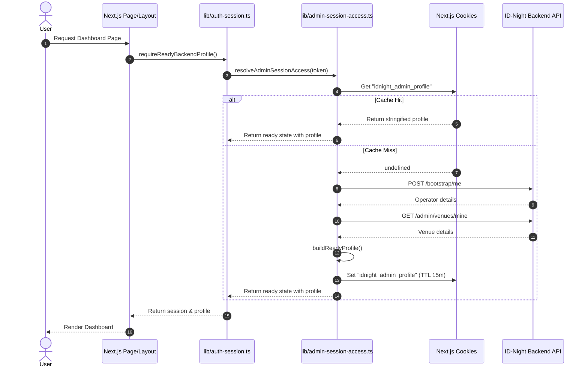

# Design: Session Authentication Optimization

## Technical Approach
Optimize admin session resolution by caching the user's admin operator profile in an HTTP-only secure cookie (`idnight_admin_profile`) and refactoring venue lookup to use a dedicated endpoint (`GET /admin/venues/mine`). Per-request caching is guaranteed by wrapping resolution logic in React's `cache` from the `react` package. This eliminates backend API waterfalls during page navigation and layout rendering.

## Architecture Decisions

### Decision: Cookie-Based Profile Caching
**Choice**: Cache the stringified JSON profile in an HTTP-only, secure cookie named `idnight_admin_profile`.
**Rationale**: Avoids database/API queries on subsequent requests. Since the profile data size is small (~250 bytes), it easily fits under the 4KB browser cookie limit.

### Decision: Cookie TTL and Lifecycle Management
**Choice**: Set the cookie TTL to 15 minutes (900 seconds). The cookie is set with `httpOnly: true`, `secure: process.env.NODE_ENV === "production"`, `sameSite: "lax"`, and `path: "/"`. The cookie is deleted (`maxAge: 0`) upon logout, login, registration, and successful onboarding.
**Rationale**: 15 minutes balances data freshness and latency reduction. Clearing/invalidating the cache on mutation endpoints prevents stale states across auth lifecycle boundaries.

### Decision: React Request Deduplication
**Choice**: Ensure the session resolution function is wrapped using `cache` imported from the `"react"` package.
**Rationale**: Guarantees that multiple calls to resolve the session within a single server-side render pass are deduplicated into a single execution thread, avoiding duplicate cookie reads or backend requests.

### Decision: Venue Resolution Refactoring
**Choice**: Call `GET /admin/venues/mine` on the backend inside `resolveAdminSessionAccessUncached` and `fetchMyVenue`.
**Rationale**: Avoids the redundant flow of fetching all organization venues to select the first one.

## Data Flow

## File Changes
| File | Action | Description |
|---|---|---|
| `lib/auth-session.ts` | Modify | Ensure profile cookie resolution and lifecycle wrappers are aligned. |
| `lib/admin-session-access.ts` | Modify | Update resolution logic to check/set the `idnight_admin_profile` cookie, fetch venue via `GET /admin/venues/mine`, and wrap in React `cache()`. |
| `lib/idnight-backend.ts` | Modify | Refactor `fetchMyVenue` to invoke `GET /admin/venues/mine` instead of listing organization venues. |
| `app/api/auth/login/route.ts` | Modify | Clear the `idnight_admin_profile` cookie on login response. |
| `app/api/auth/logout/route.ts` | Modify | Clear the `idnight_admin_profile` cookie on logout response. |
| `app/api/auth/register/route.ts` | Modify | Clear the `idnight_admin_profile` cookie on register response. |
| `app/api/owner-onboarding/route.ts` | Modify | Clear the `idnight_admin_profile` cookie on onboarding success response. |
